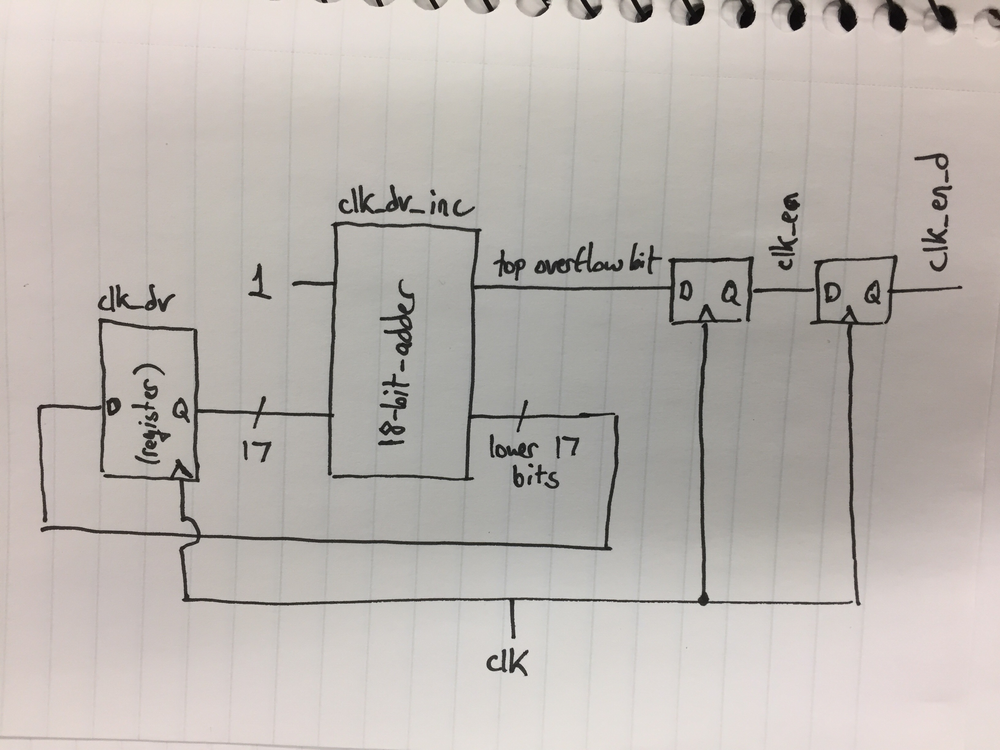
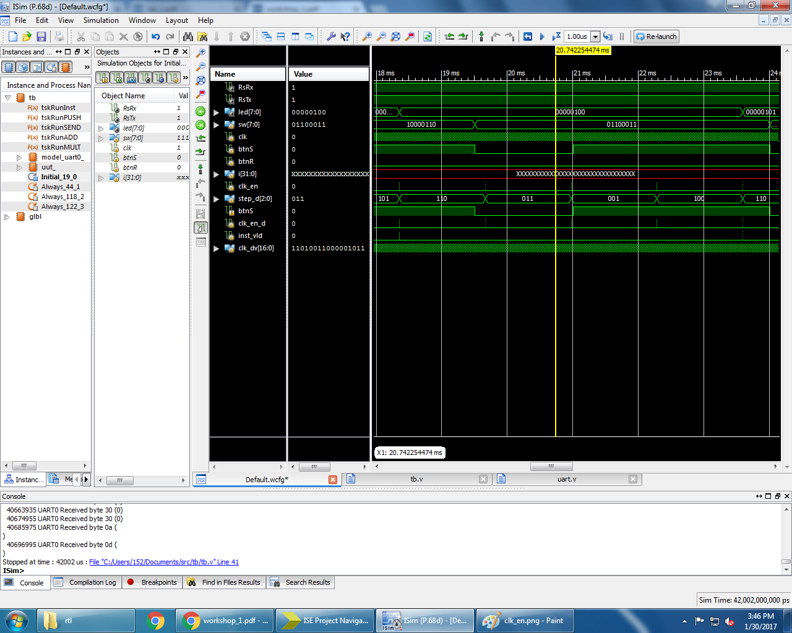
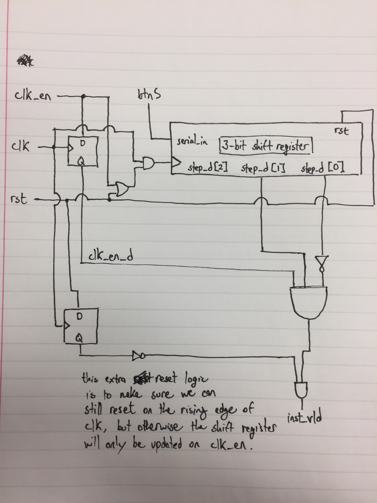
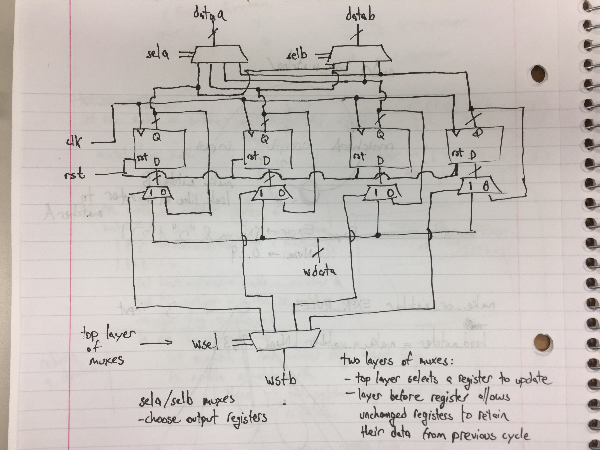
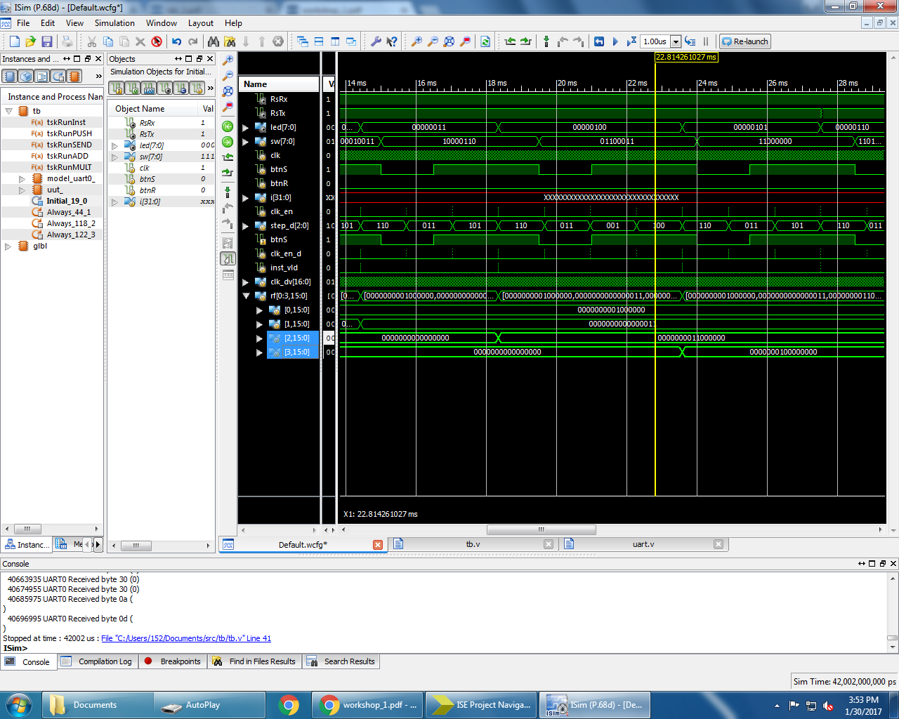

Ryan Stenberg and Rodrigo Valle

# Workshop 1 Questions

## Clock Dividers
1. Add `clk_en` to the simulation's waveform tab and then run the simulation
   again. Use the cursor to find the periodicity of this signal (you can select
   the signal and use arrow keys to reach the exact edges). Capture a waveform
   picture that shows two occurrences of clk_en, and include it in the lab
   report. Indicate the exact period of the signal in the report.

   

   The period is 1.31 milliseconds.


2. A duty cycle is the percentage of on period in which a signal or system is
   active: $D = \frac{T}{P} \times 100\%$, where $D$ is the duty cycle, $T$ is
   the interval where the signal is high, and $P$ is the period. What is the
   duty cycle of the clk_en signal?

       - time high = 0.01 us
       - period = 1.31 ms

   $$D = \frac{0.01 * 10^{-6}} {1.31 * 10^{-3}} \times 100\% = 0.00076 \%$$


3. What is the value of clk_dv signal during the clock cycle that clk_en is
   high?
   clk_dv is always zeroed out when clk_en is high.


4. Draw a simple schematic/diagram of signals clk_dv, clk_en, and clk_en_d. It
   should be a translation of the corresponding Verilog code.

   


## Debouncing
1. What is the purpose of `clk_en_d` signal when used in expression
   `inst_vld <= ~step_d[0] & step_d[1] & clk_en_d`? Why don't we use `clk_en`?

    This expression makes sure that the button is held down for at least two
    clock cycles to avoid any accidental "presses" of the button due to noise or
    other environmental factors.

    `clk_en_d` is the value of `clk_en` delayed by a cycle. We use `clk_en_d`
    instead of `clk_en` because it ensure that the shifting of `step_d` has
    already taken place when we access its values. If we were to use `clk_en`, we
    would be updating `step_d` and `inst_vld` in parallel, and we don't know what
    kind of results that might produce.


2. Instead of `clk_en <= clk_dv_inc[17]`, can we do `clk_en <= clk_dv[16]`,
   making the duty cycle of clk_en 50%? Why?

   It won't make the duty cycle 50%, it will double the previous duty cycle,
   which was fairly small so our new duty cycle will still be much less than
   50%.


3. Include waveform captures that clearly show the timing relationship between
   `clk_en`, `step_d[1]`, `step_d[0]`, `btnS`, `clk_en_d`, and `inst_vld`.

   


4. Draw a simple schematic/diagram of the signals above. It should be a direct
   translation of the Verilog code.

   

\pagebreak

## Register File
1. Find the line of code where a register is written a non-zero value. Is this
   sequential logic or combinational logic?

    Line 3:

    ``` verilog
     rf[i_wsel] <= i_wdata;
    ```

    This is sequential logic, as the register is written on each positive clock
    edge.


2. Find the lines of code where the register values are read out from the
   register file. Is this sequential or combinatorial logic? If you were to
   manually implement the read-out logic, what kind of logic elements would you
   use?

    Lines 35 and 36 are responsible for reading out the register file:

    ``` verilog
      assign o_data_a = rf[i_sel_a];
      assign o_data_b = rf[i_sel_b];
    ```


3. Draw a circuit diagram of the register file block. It should be a translation
   of the corresponding Verilog code.

   

4. Capture a waveform that shows the first time register 3 is writtten with a
   non-zero value.

   
