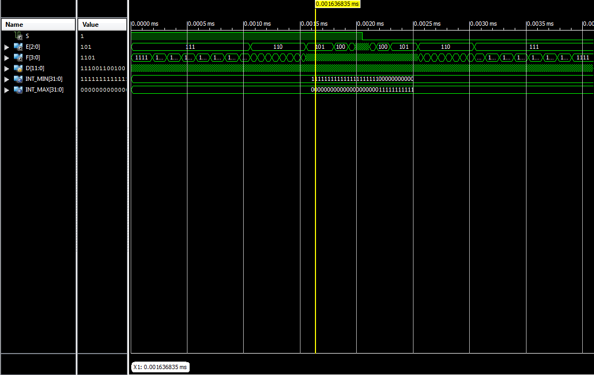

% M152A Lab 2: Floating Point Conversion
% Rodrigo Valle; Ryan Stenberg
% February 13, 2017

## Introduction
We designed a 12 to 8 bit floating point converter. It takes a 12 bit
(twos-complement) signed integer and converts it to a variant of IEEE's floating
point format. This number has 3 fields: a sign bit, three exponent bits, and
four significand bits.


## Design
This project can be broken down into the following four parts. We perform these
steps roughly in order, starting from the raw input of a signed 12 bit integer.

### Sign bit
The sign bit of our floating point output easily found by looking at the most
significant bit of the input. This takes advantage of the twos complement
format, where if the MSB is 1, the number is negative and vice versa.

``` verilog
  S = D[11];
```

### Exponent
In order to find the exponent, first we have to find the absolute value of the
input. If the number is negative, we make it positive using the formula
  $$-x = \bar{x} + 1$$

After we have ensured that all numbers will be positive, we find an estimate of
our exponent by counting the number of leading zeroes present (we still have to
deal with rounding, which might change the exponent later on). Our exponent is
equal to eight minus the number of leading zeroes, although our code does ensure
that this subtraction won't produce a negative exponent, bounding the value at
zero.

``` verilog
  // get magnitude
  if (S)
      mag = ~D + 1;
  else
      mag = D;
      
  // count leading zeroes
  lead_zeroes = 0;
  for (i = 11; i >= 0 && !mag[i] ; i = i-1)
      lead_zeroes = lead_zeroes + 1;
  
  // convert to exponent
  if (lead_zeroes < 8)
      E = 8 - lead_zeroes;
  else
      E = 0;
```

### Significand
After we have found the exponent, obtaining the significand is simple: we
simply retrieve the four bits following the last leading zero. We achieve this
using a simple right shift by the exponent that we found earlier and truncating
to the four least significant bits. Remember that right shifting one bit is the
equivalent of dividing by two, so right shifting by the exponent is the
equivalent of dividing by 2 to the exponent. This leaves us with just the four
bit significand.

``` verilog
  F = mag >> E;
```

### Rounding
Rounding in our design is based on the value of the bit following the 4
significand bits. If this bit is not set, then we truncate and the significand
remains the same. If this bit is set, then we must round up the significand.

When rounding up, the significand is increased by one. However, this means that
our four significand bits could potentially overflow. We account for this by
checking whether or not the significand will overflow when we add one to it, and
if it will overflow we instead increase the exponent by one, and set the
significand according to our new exponent. Since the exponent is now one larger,
we are able to represent numbers that are twice as large, and this range now
includes the sum of the old significand plus one.

There remains one more overflow case, and that is overflow of the exponent. We
check for overflow of the exponent before increasing it, just as with the
significand. In this case, however, we cannot continue increasing the exponent
to deal with representing larger values, so we simply set our floating point
output to the maximum value that we can represent, in compliance with the spec.
The sign bit is left unchanged.

``` verilog
  // extract the fifth bit
  round_up = E > 0 ? mag >> (E-1) : 0; // if E == 0, don't round

  // round, check for overflow of the significand
  if (round_up && F == 4'b 1111) begin
      F = 4'b 1000;
  
      // check for overflow of the exponent
      if (E == 3'b 111)
          F = 4'b 1111;
      else
          E = E + 1;
  end
  else
      F = F + round_up;
```


### Edge Case (Most Negative Number)
We must deal with one more edge case, the most negative number. This case is
special because the most negative number will remain the most negative number
even after we attempt to negate it.

Checking for the most negative number is simple. Because the most negative
number will remain unchanged following the twos complement negation, then our
count leading zeroes step will find zero leading zeroes. When we identify the
most negative number, we simply set our floating point output to the most
negative number that we can represent, in compliance with the spec.

``` verilog
  // edge case for most negative number
  if (lead_zeroes == 0) begin
      E = 3'b 111;
      F = 4'b 1111;
```


## Simulation Documentation
 - Document all simulation efforts (what requirments are tested and test cases),
   bugs we found

### Test Cases and Testbench
Our testbench iterates over all possible inputs and prints the output of our
module to a file, so that we can manually check any input or range of inputs by
searching.

The edge cases that we examined included

 - Giving INT_MIN as an input (100000000000). Our circuit should produce the
   minimum representable number in our 8 bit format.

 - Giving an input that truncates (100011010000).

 - Giving an input that rounds up (100011011000).

 - Giving an input that rounds up and overflows the significand (001111100000).
   Should increase the exponent by one and set the significand to 1000.

 - Giving an input that rounds up and overflows the significand, which overflows
   the exponent field as well (011111000000). Should produce the maximum
   representable number in our 8 bit format.


### Bugs
 - We found and fixed a bug related to handling INT_MIN incorrectly.

 - We had an issue where we would always add one to the significand without
   checking for whether our `round_up` variable was set.

 - There was another issue with an unsynthesizable for loop when we count the
   number of leading zeroes. Our for loop "while true" expression would check
   whether or not the bit at the current index was set to 1. Since a short
   circuit && must be implemented using hardware, it could potentially check a
   negative bit index. This was fixed by not having the for loop check all bits
   of the input, since it doesn't matter if there are ones in the last four
   bits: the zero-count is capped to the 8 leading bits anyway.



\pagebreak

## Conclusion
This lab posed the problem of using Verilog to create a combinational circuit
that converts as 12-bit linear encoding of an analog signal into a compounded
8-bit floating point representation. We approached this problem by breaking the
design into a sequence of steps. This included extracting the sign bit,
calculating the exponent, extracting the significand, and handling rounding. In
the end, the output is split into the three different components of an 8-bit
floating point number.

Our first mistake when begninning this project was that we implmented code to
simulate a sequential circuit instead of a combinational circuit. Once we
realized how Verilog handles combinational logic blocks, we changed our
implementation to match the spec. The other issue that we had was in handling
the exponent/significand overflow. This was solved by checking for overflow
before the rounding up addition was performed.

This lab was well written and the directions were clear.
