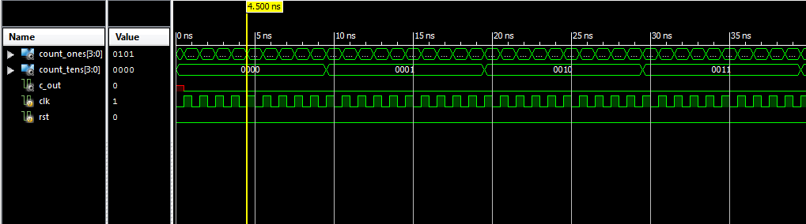
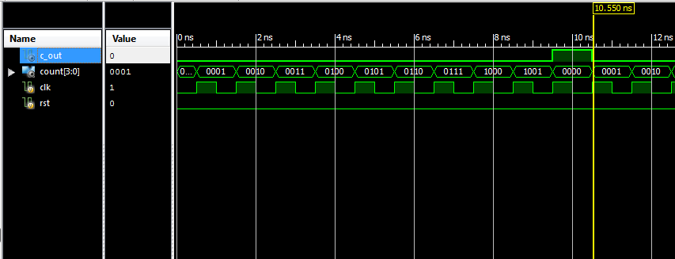
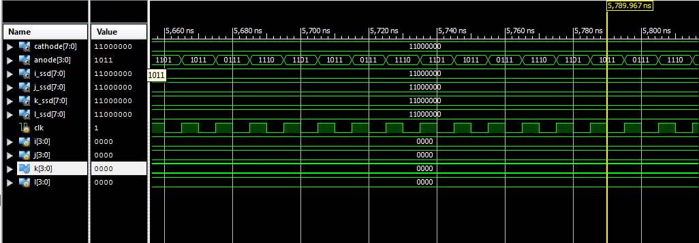

% M152A Lab 3: Stopwatch
% Ryan Stenberg; Rodrigo Valle
% February 28, 2017


## Introduction
The stopwatch we designed has a basic clock that has two two-digit fields:
minutes and seconds, which are displayed on a four digit seven segment display.
Additional features of the stopwatch include:

  - **Adjust Mode**: entered when switch zero is flipped. In adjust mode, the
    currently selected field will visibly blink as the numbers in that field
    begin increasing at 2Hz. All other fields of the stopwatch will not be
    updated in adjust mode.

  - **Select**: switch one allows a user to select which field they wish to
    adjust in adjust mode. 

  - **Reset**: when the reset button is pressed, the clock will begin counting
    from zero.

  - **Pause**: when the pause button is pressed, it toggles the stopwatch's
    pause mode. In pause mode, the stopwatch's clock will stop counting seconds.


## Design
To make this project easier to work with and split up tasks, we relied very
heavliy on reliable independent modules that were tested individually and
designed to perform only one action (where feasible) -- and do it well.

### Modules
Our design was modularized into the following components:

  - **clock_div**: a clock divider that accepted the 200 MHz FPGA master clock
    as input and divided it into a 1 Hz clock for the stopwatch to count
    seconds, a 2 Hz clock which was used for the "fast increment" during
    adjustment mode, a 4 Hz clock which was used for the display blinking, and
    a 400 Hz clock which was used to multiplex digits across each of the 4
    seven segment displays.

  - **dec_counter**: a clocked counter that simply counts to ten and supports
    reset. The c_out output will be set high when the counter overflows.

  - **counter**: created using two dec_counters, this counter represents a
    field on our stopwatch clock (e.g. the minutes or seconds field).
      - inputs: takes a clock input which decides how fast to count, and a
        reset input which will cause the counter to begin counting from zero.
      - outputs: a tens place count and a ones place count which together
        represent a number. Also outputs a c_out, which will be set high
        whenever the counter overflows, allowing us to chain these counters.

  - **debouncer**: a simple state machine to detect the falling edge of a noisy
    signal. It takes a button as input and waits until it registers a steady
    state followed by a drop off, and then synchronizes the debounced output on
    a clock edge.

  - **ssd_converter**: a simple combinational logic circuit which accepts
    a number as input and outputs the correct segments to light up on the seven
    segment display.

  - **blink**: this module sits between ssd_converter and ssd_driver and blinks
    input digits from ssd_converter on and off with the frequency of a given clock
    if the enable input is set high. Digits will not blink and simply pass through
    the module if the enable input is low.

  - **ssd_driver**: this module is responsible for multiplexing four seven
    segment display input signals across the 4 seven segment displays. This is
    done by rotating which anode is currently active among the four anodes, and
    piping in the corresponding cathodes for that anode.

  - **stopwatch**: the top level module which glues together the other modules
    we've specified here. It handles taking input from the physical FPGA controls
    and giving this input to submodules that need it (along with some control
    logic).

\pagebreak

### Module Schematic
We've labeled the components on this schematic to give a better sense of how
these modules fit together:

  

\pagebreak

### Debouncer State Machine
We used this state machine diagram to implement our debouncer; with a
relatively low sample rate, checking for two bits in a row followed by a zero
was more than enough to allow for responsive buttons without noise.

  

\pagebreak

### Bugs
  - **blink.v**: Blink logic was originally in ssd_converter module. This made
    it difficult to blink on and off at 4Hz while updating the seven segment
    display at 400Hz. As a result, our seven segment display wasn't blinking
    in adjust mode. Eventually we separated it out into its own module called
    blink.v which was placed as an intermediary between ssd_converter and
    ssd_driver. This allowed us to tell the ssd_driver to show nothing every
    4Hz.

  - **counter.v**: Had an off by one error that caused our seconds and minutes
    to reset at 50 instead of 60. This was simply a comparison error in which
    we reset the tens spot once a positive clock edge hit and the tens digit
    became 5. This was fixed by changing this comparison to wait for 59
    seconds/minutes before reseting to 0.

  - **ssd_converter.v**: Was converting all 6s to 5s so that our seven segment
    display counted up with the following sequence ...3,4,5,5,7,8... The bug
    was in the switch statement where we had accidentally routed binary 6 to
    the cathode display of 5. This was also a quick fix once we isolated this
    problem.

  - **Reset**: Pressing reset wouldn't reset the tens in minutes or seconds
    (the ones would get reset). This bug was in the counter.v module. We were
    only reseting the tens digit if the reset was being held down while the
    ones digit incremented from 9 $\rightarrow$ 10 (overflow). Of course this
    never occurred because when the reset button was pressed, the ones digit
    was set to 0 and could not increment. This was fixed by changing our
    if-else statements to allow reset to reset both the ones and
    tens digits with the next clock cycle.


## Simulation Documentation
We tested all basic functionality of a stopwatch including counting up, reset,
pause, adjust, and select (seconds & minutes). In doing so we kept an eye out
for the following events and edge cases:

  - adjust mode caused whichever set of digits (seconds/minutes) was selected
    to blink and increase at an elevated speed
  - pause stopped the stopwatch from all increments until toggled back off
  - the seven segment display showed all 10 possible digits correctly (0-9)
  - the seven segment display rotated anodes fast enough to not be noticeable
    to the human eye
  - incrementing from 59 seconds to 1 minute and also 59 minutes back to 0
    minutes

We created testbenches for several individual modules. These test benches,
along with the waveforms they produced are provided below.

### counter_tb.v


This testbench exercises the counter module through all possible states by
clocking it and waiting long enough for the counter to overflow. Any errors in
output will be noticed visually as counter outputs are printed to the screen.

``` verilog
module counter_tb;
    reg clk, rst;
    wire [3:0] count_ones;
    wire [3:0] count_tens;
    wire c_out;

    initial begin
        clk = 0;
        rst = 0;
        #50 $finish;
    end

    always begin
        #0.5 clk = ~clk;
    end

    always @(posedge clk) begin
        $display("count: %d%d\n", count_tens, count_ones,
                 "c_out: %b\n", c_out);
    end

    counter counter_inst(
        .clk(clk),
        .rst(rst),
        .count_ones(count_ones),
        .count_tens(count_tens),
        .c_out(c_out)
    );
endmodule
```
\pagebreak


### dec_counter_tb.v


This testbench exercises the dec_counter module until it overflows, printing
out the count and c_out of the dec_counter to the screen as it counts. Any
errors will be inspected visually on the screen. This module is very simple, so
this testbench is more of a sanity check for us.

``` verilog
module dec_counter_tb;
    reg clk, rst;
    wire       c_out;
    wire [3:0] count;

    initial begin
        clk = 0;
        rst = 0;
        #20 $finish;
    end

    always
        #0.5 clk = ~clk;

    always @(posedge clk)
        $display("count: %d\n", count,
                 "c_out: %b\n", c_out);

    dec_counter counter(
        .clk(clk),
        .rst(rst),
        .count(count),
        .c_out(c_out)
    );
endmodule
```
\pagebreak


### ssd_driver_tb.v


This testbench exercises the ssd_driver module as it mutliplexes across
4 different seven segment display anodes. It'll print out which anode is active
to the screen, along with the corresponding cathodes that should be lit for
that particular anode.

``` verilog
module ssd_driver_tb;
    reg clk;
    wire [7:0] cathode;
    wire [3:0] anode;

    reg [3:0] i;
    reg [3:0] j;
    reg [3:0] k;
    reg [3:0] l;

    wire [7:0] i_ssd;
    wire [7:0] j_ssd;
    wire [7:0] k_ssd;
    wire [7:0] l_ssd;

    initial begin
        clk = 0;
        i = 0;
        j = 0;
        k = 0;
        l = 0;
        $monitor("At time: %t\n", $time,
                 "cathode: %b\n", cathode,
                 "anode: %b", anode);
        # 10000 $finish;
    end

    always begin
        #5 clk = ~clk;
    end

    ssd_converter i_converter(
        .n(i),       // input
        .ssd(i_ssd)  // output
    );

    ssd_converter j_converter(
        .n(i),       // input
        .ssd(j_ssd)  // output
    );
    ssd_converter k_converter(
        .n(i),       // input
        .ssd(k_ssd)  // output
    );

    ssd_converter l_converter(
        .n(i),       // input
        .ssd(l_ssd)  // output
    );

    ssd_driver driver(
        .clk(clk),
        .digit1(i_ssd),
        .digit2(j_ssd),
        .digit3(k_ssd),
        .digit4(l_ssd),
        .cathode(cathode),
        .anode(anode)
    );

endmodule
```
\pagebreak


## Conclusion
We broke our stopwatch down into a series of submodules which helped speed our
development and testing process. Testing for this project was rather difficult
because any testbenches that contained a clock that went anywhere near as fast
as the FPGA's onboard clock would take quite a while -- testing with a 200 MHz
clock was clearly not an option. This meant that testing had to be done on a
per module basis, and that kept our testbenches fairly short and clean.

The features of our design mapped pretty clearly to a specific module that
implements it. The fields of our stopwatch display are driven by two counter
modules, each of which depends on two dec_counter modules, one for each digit
(a field is two digits representing either seconds or minutes). These counters
are then fed into ssd_converter which turns them into seven segement display
inputs. These are then passed through a blink module, which is reponsible for
blinking the fields on and off at 4Hz when in adjust mode. Finally, these
digits are multiplexed by a single ssd_driver module which displays all four
digits by quickly rotating the anode that is connected.

Inputs to our FPGA, specifically button inputs, are debounced using the
debouncer module. This module will track the history of the button input,
looking for some length of a steady "high" state followed by a "low" state, and
will synchronize the button output on a rising clock edge.

This project was difficult because there were so many different parts, in
particular, we had a lot of trouble with the counter module. This module often
reset too early or not at all because we had to hard-reset the seconds counter
once it hit 59 seconds. This proved more difficult than we thought because
dec_counters naturally reset when they hit 9, so we had to check to see whether
the tens place was "6" at every clock cycle and ensure that the counter
registered the call to reset on the next clock cycle when we found a 6.
